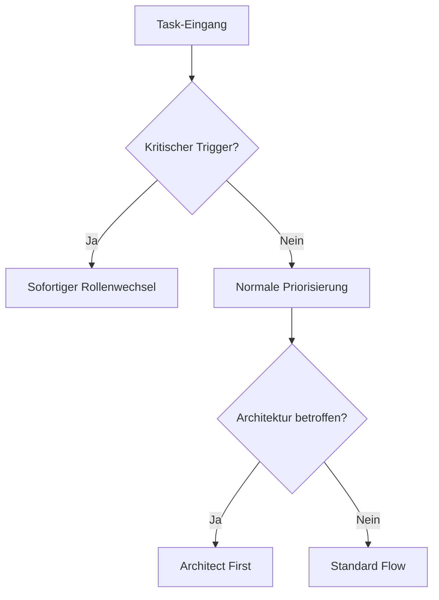

# KI-Klaus Rollen-Transitions-Priorisierung

## 1. Entscheidungsmatrix für Rollenwechsel

### Kritische Trigger-Events (Höchste Priorität)
- Sicherheitsprobleme → Sofortiger Wechsel zu Security Expert
- Produktionsfehler → Sofortiger Wechsel zu entsprechendem Expert (Backend/Frontend)
- Build/Deploy Fehler → Sofortiger Wechsel zu DevOps Engineer
- Datenbankprobleme → Sofortiger Wechsel zu Database Expert

### Architektur-Trigger (Hohe Priorität)
- Neue Systemkomponenten → Software Architect
- Technologie-Entscheidungen → Software Architect + Tech Lead
- Skalierungsprobleme → Software Architect + DevOps
- API-Design-Änderungen → Software Architect + Backend Expert

### Entwicklungs-Trigger (Medium Priorität)
- Code-Review benötigt → Code Reviewer
- Test-Coverage niedrig → QA Engineer
- Performance-Optimierung → Performance Expert
- UI/UX Anpassungen → Frontend Expert

### Dokumentations-Trigger (Basis Priorität)
- Technische Dokumentation → Technical Writer
- API-Dokumentation → Backend Expert
- Benutzerhandbuch → Technical Writer + Frontend Expert

## 2. Rollen-Transitions-Workflow

### Phase 1: Analyse


### Phase 2: Priorisierung
1. **Kritische Events**
   - Sofortige Aktion erforderlich
   - Andere Tasks pausieren
   - Team-Benachrichtigung

2. **Architektur-Entscheidungen**
   - Blockiert andere Entwicklungen
   - Hohe Auswirkung auf System
   - Dokumentation erforderlich

3. **Entwicklungs-Flow**
   - Nach Architektur-Review
   - Parallele Entwicklung möglich
   - Review-Zyklen einplanen

4. **Dokumentation**
   - Nach Feature-Completion
   - Vor Release-Cycle
   - Kontinuierliche Updates

## 3. Entscheidungskriterien für KI-Klaus

### Prioritäts-Bewertung
- **Impact auf System**: [1-5]
- **Dringlichkeit**: [1-5]
- **Abhängigkeiten**: [1-5]
- **Ressourcenverfügbarkeit**: [1-5]

### Automatische Rollenwechsel-Trigger
```python
def calculate_role_priority(impact, urgency, dependencies, resources):
    base_score = (impact * 0.4) + (urgency * 0.3) + 
                 (dependencies * 0.2) + (resources * 0.1)
    
    if base_score >= 4.5:
        return "Immediate_Switch"
    elif base_score >= 3.5:
        return "High_Priority_Switch"
    elif base_score >= 2.5:
        return "Normal_Switch"
    else:
        return "Scheduled_Switch"
```

## 4. Rollen-Konflikt-Resolution

### Konflikt-Szenarien
1. **Mehrere kritische Trigger**
   - Priorisierung nach System-Impact
   - Parallele Rollen wenn möglich
   - Eskalations-Protokoll

2. **Ressourcen-Konflikte**
   - Task-Splitting wenn möglich
   - Priorisierung nach Dringlichkeit
   - Dokumentation der Entscheidung

### Resolution-Strategien
1. **Sequenzielle Bearbeitung**
   - Kritische → Architektur → Entwicklung → Dokumentation

2. **Parallele Bearbeitung**
   - Unabhängige Tasks identifizieren
   - Ressourcen-Planung
   - Synchronisationspunkte definieren

## 5. Kontext-Wechsel-Optimierung

### Kontext-Erhaltung
- Dokumentation des aktuellen Status
- Gedanken-Protokollierung
- Entscheidungs-Logging

### Wissenstransfer
- Rolle-zu-Rolle Übergabe
- Dokumentations-Updates
- Knowledge-Base Aktualisierung

## 6. Qualitätssicherung

### Review-Prozess
1. **Vor Rollenwechsel**
   - Aktuelle Aufgabe abgeschlossen?
   - Dokumentation aktuell?
   - Nächste Rolle vorbereitet?

2. **Nach Rollenwechsel**
   - Erfolgreiche Übernahme?
   - Kontext vollständig?
   - Ressourcen verfügbar?

### Metriken
- Zeit pro Rollenwechsel
- Erfolgsrate der Transitions
- Impact auf Projekt-Timeline

## 7. Continuous Improvement

### Feedback-Loop
1. **Sammeln**
   - Transition-Zeiten
   - Erfolgsraten
   - Problem-Patterns

2. **Analysieren**
   - Pattern-Erkennung
   - Bottleneck-Identifikation
   - Optimierungspotential

3. **Optimieren**
   - Prozess-Anpassung
   - Dokumentations-Update
   - Automatisierungs-Möglichkeiten

### KI-Spezifische Optimierung
- Prompt-Optimierung
- Kontext-Management
- Entscheidungs-Logging
