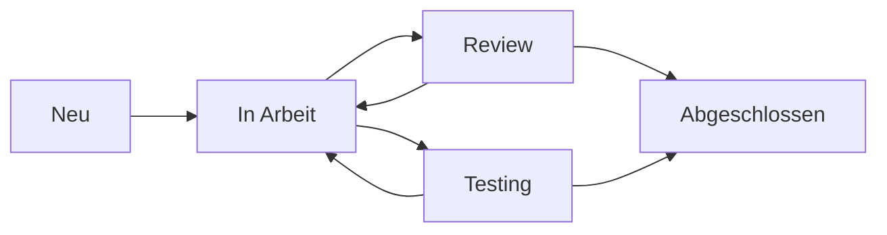

# Integration von Git mit dem bestehenden System

## 1. Task-Management Integration

### Verknüpfung von Tasks und Git

```plaintext
/dev/
├── currentTask_[TIMESTAMP].md  # Bisheriges System
└── tasks/
    ├── active/
    │   └── TASK-[ID]/
    │       ├── description.md      # Task-Beschreibung
    │       ├── branch.txt          # Aktueller Git-Branch
    │       └── commits.json        # Verknüpfte Commits
    └── completed/
        └── [YYYY-MM]/
```

### Automatische Task-Updates
```javascript
// Git Hook: post-commit
const taskId = extractTaskIdFromBranch();
const commitHash = getCurrentCommitHash();
const taskPath = `/dev/tasks/active/TASK-${taskId}`;

// Commit in Task-Historie aufnehmen
updateTaskCommits(taskPath, {
    hash: commitHash,
    timestamp: new Date(),
    message: getCommitMessage()
});

// Task-Status aktualisieren
updateTaskStatus(taskPath);
```

## 2. Dokumentations-Integration

### Automatische Dokumentationsaktualisierung

```plaintext
/docs/
├── auto-generated/          # Automatisch generierte Docs
│   ├── changelog.md         # Aus Commits generiert
│   └── task-reports/        # Task-Status-Reports
├── manual/                  # Manuelle Dokumentation
└── templates/              # Dokumentvorlagen
```

### Commit-zu-Dokumentation Pipeline
```yaml
# .github/workflows/docs.yml
name: Documentation Update
on: [push]
jobs:
  update-docs:
    runs-on: ubuntu-latest
    steps:
      - uses: actions/checkout@v2
      - name: Update Changelog
        run: ./scripts/update_changelog.sh
      - name: Update Task Reports
        run: ./scripts/update_task_reports.sh
      - name: Commit Documentation
        run: |
          git config user.name "CI Bot"
          git add docs/auto-generated/
          git commit -m "docs: Update auto-generated documentation"
```

## 3. Workflow-Integration

### Task-Erstellung und Branch-Management

```bash
#!/bin/bash
# create-task.sh

# 1. Task-Datei erstellen
TIMESTAMP=$(date +%Y%m%d_%H%M%S)
TASK_ID="TASK-$TIMESTAMP"
TASK_DIR="/dev/tasks/active/$TASK_ID"

mkdir -p "$TASK_DIR"
cp /docs/templates/task_template.md "$TASK_DIR/description.md"

# 2. Git-Branch erstellen
BRANCH_TYPE=$1  # feature, bugfix, etc.
BRANCH_NAME="$BRANCH_TYPE/$TASK_ID-$2"
git checkout -b "$BRANCH_NAME" develop

# 3. Branch-Info speichern
echo "$BRANCH_NAME" > "$TASK_DIR/branch.txt"
```

### Commit-Message-Template
```
# .gitmessage
[TASK-ID] Typ: Kurze Beschreibung

- Detaillierte Beschreibung
- Weitere Informationen

Task: #TASK-ID
Status: [IN_PROGRESS|COMPLETED|TESTING]
```

## 4. Status-Tracking

### Task-Status-Workflow


### Automatische Status-Updates
```python
# status_updater.py
def update_task_status(commit_message):
    task_id = extract_task_id(commit_message)
    status = extract_status(commit_message)
    
    task_path = f"/dev/tasks/active/TASK-{task_id}"
    if status == "COMPLETED":
        move_to_completed(task_path)
    else:
        update_status(task_path, status)
```

## 5. Pull Request Integration

### PR-Template
```markdown
# Pull Request für TASK-[ID]

## Beschreibung
- [Task-Link]
- [Änderungsbeschreibung]

## Checkliste
- [ ] Tests geschrieben/aktualisiert
- [ ] Dokumentation aktualisiert
- [ ] Task-Status aktualisiert
```

### Automatische PR-Validierung
```yaml
# .github/workflows/pr-validation.yml
name: PR Validation
on: [pull_request]
jobs:
  validate:
    runs-on: ubuntu-latest
    steps:
      - uses: actions/checkout@v2
      - name: Validate Task Status
        run: ./scripts/validate_task.sh
      - name: Check Documentation
        run: ./scripts/check_docs.sh
```

## 6. Reporting und Überwachung

### Task-Fortschritts-Dashboard
```javascript
// dashboard-generator.js
function generateDashboard() {
    const tasks = getAllTasks();
    const gitMetrics = getGitMetrics();
    
    return {
        activeTasks: tasks.filter(t => t.status !== 'COMPLETED'),
        completedThisWeek: tasks.filter(t => isCompletedThisWeek(t)),
        commitsByTask: gitMetrics.commitsByTask,
        averageCompletionTime: calculateAvgCompletionTime(tasks)
    };
}
```

### Automatische Reports
```bash
#!/bin/bash
# generate_reports.sh

# Wöchentlicher Report
generate_task_report
generate_git_metrics
update_dashboard

# Report committen
git add reports/
git commit -m "docs: Update weekly reports"
```

## 7. Migration vom alten System

### Migrations-Schritte

1. **Bestehende Tasks konvertieren**
```bash
#!/bin/bash
# migrate_tasks.sh

# Für jeden currentTask
for task in /dev/currentTask_*.md; do
    # Task-ID generieren
    TASK_ID="TASK-$(date +%Y%m%d%H%M%S)"
    
    # Neue Struktur erstellen
    mkdir -p "/dev/tasks/active/$TASK_ID"
    
    # Task konvertieren
    convert_task "$task" "/dev/tasks/active/$TASK_ID/description.md"
    
    # Git-Branch erstellen
    create_task_branch "$TASK_ID"
done
```

2. **Dokumentation anpassen**
```bash
#!/bin/bash
# update_docs.sh

# Templates aktualisieren
cp git_workflow.md /docs/manual/
cp git_integration.md /docs/manual/

# Alte Docs archivieren
mkdir -p /docs/archive
mv /dev/currentTask_*.md /docs/archive/
```

Diese Integration verbindet das bestehende Task-Management-System mit Git durch:

1. Automatische Verknüpfung von Tasks und Git-Branches
2. Statusaktualisierung durch Commit-Messages
3. Automatische Dokumentationsgenerierung
4. Integriertes Reporting-System
5. Nahtlose Migration vom alten System

Die Kombination ermöglicht eine effizientere Verwaltung von Tasks und Code-Änderungen, während die bewährten Aspekte des bestehenden Systems beibehalten werden.
